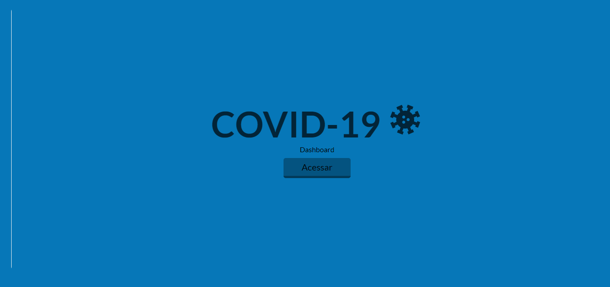
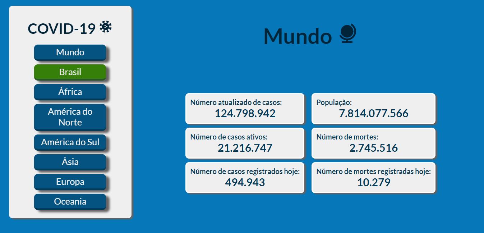

<h1  align="center">🧫 COVID-19 - Dashboard 🔬</h1>

<p></p>

> 🔬 Dashboard com dados de casos e mortes registrados de Covid-19 no Brasil e nos resto do mundo.

<p align="center">
 <a href="#overview">Overview</a> •
 <a href="#demonstracao">Demonstração</a> •
 <a href="#comousar">Como usar</a> •
 <a href="#tecnologias">Tecnologias</a> • 
 <a href="#autora">Autora</a>
</p>

<h2 id="overview">✨ Overview</h2>

<p>
O dashboard mostra dados de casos e mortes registradas desde o início da pandemoa e apenas no dia de hoje. 
A aplicação possui uma página para os números do mundo todo, uma para os números do Brasil e uma para cada continente.
Os dados são integrados e consumidos através de API e estão sujeitos a atraso devido a divulgação de cada país.
</p>

<h2 id="demonstracao">🖱 Demonstração</h2>

<p>
  <span></span>
  <span></span>
</p>

<h2 id="comousar">⚒️ Como usar</h2>

<h3>Pré-requisitos</h3>

<p>
    Antes de começar você vai precisar ter instalado em sua máquina as seguintes ferramentas:
    <ul>
      <li><a href="https://nodejs.org/en/">Node.js</a></li>
      <li><a href="https://yarnpkg.com/">Yarn</a></li>
    </ul>

    Também é bom ter um editor para trabalhar com o código como o 
  <a href="https://code.visualstudio.com/">VSCode</a>
</p>

<h3>Instalação</h3>
  <p>Abra esse projeto no seu editor de código ou no terminal do seu computador e execute o comando abaixo.</p>

  ```sh

yarn install

```

<h3>Rodando a aplicação</h3>
  <p>No terminal execute o comando abaixo.</p>

```sh

yarn start

```

<p>A aplicação será aberta na porta:3000. No seu navegador acesse http://localhost:3000</p>


<h2 id="tecnologias">🛸 Tecnologias</h2>
  
  <p>
    As seguintes ferramentas foram usadas no desenvolvimento dessa aplicação:
    <ul>
      <li><a href="https://nodejs.org/en/">Node.js</a></li>
      <li><a href="https://pt-br.reactjs.org/">React.js</a></li>
      <li><a href="https://www.framer.com/motion/">Frmer Motion</a></li>
      <li><a href="https://corona.lmao.ninja/docs/">API</a></li>
    </ul>
  </p>

  <h2 id="autora">👤 Autora</h2>

<h3>Desenvolvido com 💖 por Luiza Campos</h3>

* [Linkedin](https://linkedin.com/in/luiza-de-almeida-campos)
* [Github](https://github.com/luizaacampos)
  
<strong align="center">Se gostar deixe sua ⭐️</strong>


